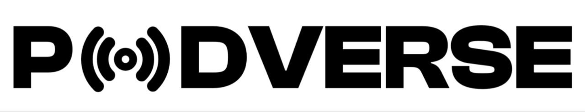

<div align="center">
    <a>
        
    </a>
</div>

**Podverse** is a live podcast streaming platform where creators can broadcast their podcasts in real-time to an engaged audience. Listeners can tune in, chat with the hosts, and participate in live discussions, all within a seamless and user-friendly interface. With Podverse, users can discover new podcasts through live streams.

## Table of Contents

- [Project Overview](#project-overview)
- [Architecture](#architecture)
- [Technologies Used](#technologies-used)
- [Prerequisites](#prerequisites)
- [Setup Instructions](#setup-instructions)
- [Usage](#usage)
- [Testing](#testing)
- [License](#license)

## Project Overview

Podverse consists of two main components:
1. **Backend**: Responsible for handling real-time podcast streams, user management, and data storage.
2. **Frontend**: Provides the user interface for both podcasters and listeners, enabling them to interact with the platform and each other.

Together, these components create a live streaming platform with real-time interactions, allowing users to discover, listen to, and engage with podcasts.

## Architecture

The Podverse platform follows a microservice architecture with separate repositories for the frontend and backend:

- **Backend**: [alx-podverse-backend](https://github.com/ShenoudaMikhael/alx-podverse-backend)  
  The backend service handles:
  - Real-time audio streaming using **WebSockets** and **Simple-Peer**.
  - Media processing and encoding via **FFmpeg**.
  - Data management with **Sequelize** ORM and **MySQL** database.
  - Web server functionality using **Express.js**.
  - User authentication and live chat handling.

- **Frontend**: [alx-podverse-frontend](https://github.com/ShenoudaMikhael/alx-podverse-frontend)  
  The frontend provides the UI for:
  - Podcasters to start live broadcasts.
  - Listeners to discover and join live streams.
  - Live chat during broadcasts.
  - Interactive and responsive UI elements using **React**, **TailwindCSS**, **Shadcn/UI**, and **Next.js** for server-side rendering and routing.

Both repositories work together to form the complete Podverse application.

## Technologies Used

### Backend:
- **Express.js**: Web framework for handling HTTP requests.
- **WebSockets**: Enables real-time communication between clients and servers.
- **Sequelize**: ORM for interacting with a **MySQL** database.
- **FFmpeg**: For handling media streaming and encoding.
- **Simple-Peer**: WebRTC implementation for peer-to-peer audio streaming.

### Frontend:
- **React**: UI library for building interactive components.
- **TailwindCSS**: Utility-first CSS framework for styling.
- **Shadcn/UI**: UI components for modern web development.
- **Next.js**: Framework for server-side rendering and routing.

### Database:
- **MySQL**: Relational database used for storing user, podcast, and stream data.

## Prerequisites

Make sure you have the following installed:

- **Node.js** (>= v14.x) and **npm** for frontend and backend.
- **MySQL** (for the database).
- **FFmpeg** (for media processing).

## Setup Instructions

### Frontend Setup Instructions

Follow these steps to set up the frontend for **Podverse**.

1. **Clone the repository**

   ```bash
   git clone https://github.com/ShenoudaMikhael/alx-podverse-frontend
   ```
   ```bash
   cd alx-podverse-frontend
   ```

2. **Install dependencies**
   ```bash
   npm install
   ```

3. **Start the frontend server**
   ```bash
   npm run dev
   ```

## Usage
**Run Backend:** Make sure your MySQL server is running, and start the backend server:

```bash
cd alx-podverse-backend
npm start
```
**Run Frontend:** In a separate terminal, start the frontend server:

```bash
cd alx-podverse-frontend
npm run dev
```
Open the frontend in your browser (typically at http://localhost:3001) and interact with the platform.

## Testing
You can test the Podverse application by:

- Running both the backend and frontend as described in the Usage section.
- Opening multiple browser windows to simulate different users (podcasters and listeners).
- Broadcasting a live stream from the podcaster's side and joining it from a listener's side.
Ensure the chat and media streaming functionalities work as expected.

## License
This project is licensed under the MIT License - see the LICENSE file for details.
